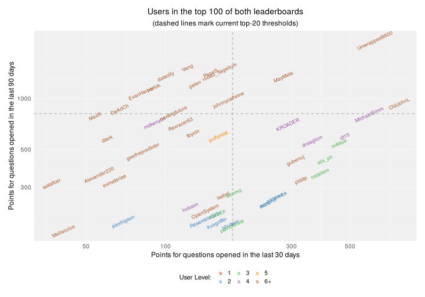

Metaculus Beginners on Points Leaderboard
================
maurogm
2023-02-18

-   [Preparation](#preparation)
    -   [Load libraries](#load-libraries)
    -   [Define paths](#define-paths)
    -   [Define functions](#define-functions)
    -   [Data preparation](#data-preparation)
-   [Exploration](#exploration)
    -   [User evolution](#user-evolution)
    -   [User points](#user-points)
    -   [Recent performance](#recent-performance)
-   [Predicted leaderboard:](#predicted-leaderboard)
-   [Export table](#export-table)

# Preparation

## Load libraries

``` r
library(data.table)
library(magrittr)
library(dplyr)
library(ggplot2)
library(tidyverse)
library(readxl)
library(ggrepel)
```

## Define paths

``` r
PATH_DATA_DIR <- "data/tournaments/beginner_2023Q1"
PATH_TOURNAMENT_LEADERBOARD <- glue::glue("{PATH_DATA_DIR}/beginner_tournament_leaderboard.xls")
PATH_RANKING_30_DAYS <- glue::glue("{PATH_DATA_DIR}/metaculus_ranking_30_days.xls")
PATH_RANKING_90_DAYS <- glue::glue("{PATH_DATA_DIR}/metaculus_ranking_90_days.xls")

date_labels <- tribble(
    ~date, ~label,
    "2023-02-07", "Initial meassurement",
    "2023-02-08", "Yoga W02 resolution",
    "2023-02-12", "Club World Cup resolution",
    "2023-02-13", "Book ratings expiring",
    "2023-02-14", "ALOS-3 resolution",
    "2023-02-15", "Yoga W03 resolution",
    "2023-02-18", "Building permits resolution",
    "2023-02-19", "Bakhmut expiring",
    "2023-02-20", "Influenza & Doomsday expiring",
    "2023-02-27", "Yoga & Snow expiring",
) %>%
    mutate(label = ordered(label, levels = label))
dates_with_points_relevant_for_resolution <- date_labels[c(3, 5, 7), ]
```

## Define functions

#### Data wrangling functions

``` r
extract_level <- function(vec) stringr::str_extract(vec, "[0-9]+") %>% as.integer()
truncate_level <- function(level, bound = 5) ifelse(as.numeric(level) > bound, "6+", level)
read_ranking <- function(path, sheet_name, leaderboard_type) {
    df <- read_excel(path, sheet = sheet_name)
    add_suffix <- function(colname) paste0(colname, "_", leaderboard_type)
    df %>%
        mutate(level = extract_level(Level)) %>%
        mutate(date = sheet_name) %>%
        select(date, User, level, Rank, Points) %>%
        setnames(c("date", "user", "level", add_suffix("rank"), add_suffix("points")))
}
read_tournament_leaderboard <- function(path, sheet_name, leaderboard_type = "tournament") {
    extract_denominators <- function(v) {
        stringr::str_extract(v, "/[0-9]+") %>%
            stringr::str_replace("/", "")
    }
    extract_numerators <- function(v) {
        stringr::str_extract(v, "[0-9]+/") %>%
            stringr::str_replace("/", "")
    }

    df <- read_excel(path, sheet = sheet_name)
    df %>%
        mutate(
            date = sheet_name,
            answered = as.integer(extract_numerators(Completion)),
            total = as.integer(extract_denominators(Completion)),
            completion = answered / total,
            coverage = as.numeric(stringr::str_remove(Coverage, "%")) / 100
        ) %>%
        select(
            date,
            user = Forecaster,
            rank = Rank,
            take = Take,
            score = Score,
            coverage,
            completion,
            answered,
            total,
        ) %>%
        setnames(old = c("rank"), new = c(paste0("rank_", leaderboard_type)))
}

read_all_sheets <- function(path_to_file, read_function, leaderboard_type) {
    readxl::excel_sheets(path_to_file) %>%
        map(
            ~ read_function(path_to_file, ., leaderboard_type)
        ) %>%
        rbindlist()
}
```

#### Data viz functions

``` r
apply_theme <- function() {
    theme_minimal() +
        theme(
            legend.position = "bottom",
            legend.text = element_text(size = 10),
            legend.key.size = unit(0.5, "cm"),
            plot.title = element_text(size = 14, hjust = 0.5),
            plot.subtitle = element_text(size = 12, hjust = 0.5),
            axis.title = element_text(size = 12),
            axis.text = element_text(size = 10),
            # panel.background = element_rect(fill = "white", color = "black"),
            # panel.border = element_rect(fill = NA, color = "black"),
            # give very light gray background to the plot area, with no box border:
            panel.background = element_rect(fill = "#F0F0F0", color = NA),
            panel.grid.major = element_line(color = "#F5F5F5"),
            panel.grid.minor = element_line(color = "#F7F7F7"),
            plot.margin = unit(c(0.5, 0.5, 0.5, 0.5), "cm")
        )
}

trunc_level_color_scale <- function() {
    scale_color_manual(
        values = c("#e41a1c", "#377eb8", "#4daf4a", "#984ea3", "#ff7f00", "#a65628"),
        breaks = c("1", "2", "3", "4", "5", "6+"),
    )
}
```

Source utils:

``` r
source("R/utils/metaculus.R")
```

## Data preparation

### Read and wrangle data

``` r
tournament_leaderbord <- read_all_sheets(path_to_file = PATH_TOURNAMENT_LEADERBOARD, read_function = read_tournament_leaderboard, leaderboard_type = "tournament")
df_30_days <- read_all_sheets(PATH_RANKING_30_DAYS, read_ranking, "30_days") %>%
    mutate(is_top_20 = rank_30_days <= 20)
df_90_days <- read_all_sheets(PATH_RANKING_90_DAYS, read_ranking, "90_days")

df_joined <- df_30_days %>%
    merge(df_90_days, by = c("date", "user", "level"), all = TRUE) %>%
    merge(tournament_leaderbord, by = c("date", "user"), all = TRUE) %>%
    merge(date_labels, "date")

df_current <- df_joined[date == max(date)]

current_point_cutoff_30 <- df_current[
    rank_30_days %in% c(20, 21),
    median(points_30_days)
]
current_point_cutoff_90 <- df_current[
    rank_90_days %in% c(20, 21),
    median(points_90_days)
]
```

# Exploration

## User evolution

``` r
top_score <- max(df_joined$score, na.rm = TRUE)
df_joined %>%
    arrange(date) %>%
    setDT() %>%
    .[, delta := score - lag(score), user] %>%
    .[, is_active := any(delta != 0, na.rm = TRUE), user] %>%
    .[!str_ends(label, "expiring")] %>% 
    mutate(level = truncate_level(level)) %>%
    ggplot(aes(x = date, y = score)) +
    geom_point(aes(shape = is_top_20)) +
    geom_path(aes(group = user), # arrows where score didn't change
        data = ~ filter(., !is_active),
        alpha = 0.2,
        linetype = "dotted",
        arrow = arrow(length = unit(4, "mm"), ends = "last")
    ) +
    geom_path(aes(group = user, color = level), # arrows where score did change
        data = ~ filter(., is_active),
        arrow = arrow(length = unit(4, "mm"), ends = "last")
    ) +
    ggrepel::geom_text_repel(aes(label = user, color = level),
        data = filter(df_current, is_top_20) %>%
            mutate(level = truncate_level(level)),
        nudge_x = 0.15
    ) +
    geom_label(
        data = filter(date_labels, !str_ends(label, "expiring")), aes(x = date, label = label), y = top_score + 0.1,
        size = 3, angle = 25, color = "black", fill = "white", alpha = 0.8
    ) +
    labs(
        title = "Evolution of tournament scores",
        caption = "(Only users currently in the top 20 of the 30-day leaderboard are labeled)",
        x = "Date",
        y = "Tournament Score",
        shape = "Is in top 20?",
        color = "Level: "
    ) +
    trunc_level_color_scale() +
    apply_theme()
```

<!-- -->

``` r
df_joined %>%
    arrange(date) %>%
    setDT() %>%
    mutate(level = truncate_level(level)) %>%
    ggplot(aes(x = date, y = points_30_days)) +
    geom_point(aes(shape = is_top_20)) +
    geom_path(aes(group = user, color = level), alpha = 0.5,
        arrow = arrow(length = unit(4, "mm"), ends = "last")
    ) +
    ggrepel::geom_text_repel(aes(label = user, color = level),
        data = filter(df_current, is_top_20) %>%
            mutate(level = truncate_level(level)),
        nudge_x = 0.15
    ) +
    geom_label(
        data = date_labels, aes(x = date, label = label), y = top_score + 0.1,
        size = 3, angle = 25, color = "black", fill = "white", alpha = 0.8
    ) +
    labs(
        title = "Evolution of points in the last 30 days",
        caption = "(Only users currently in the top 20 of the 30-day leaderboard are labeled)",
        x = "Date",
        y = "Points",
        shape = "Is in top 20?",
        color = "Level: "
    ) +
    trunc_level_color_scale() +
    apply_theme()
```

<!-- -->

## User points

``` r
df_current %>%
    mutate(level = truncate_level(level)) %>%
    ggplot(aes(x = points_30_days, y = points_90_days, color = level)) +
    geom_text(aes(label = user), size = 3, angle = 25) +
    geom_vline(xintercept = current_point_cutoff_30, linetype = "dashed", alpha = 0.3) +
    geom_hline(yintercept = current_point_cutoff_90, linetype = "dashed", alpha = 0.3) +
    trunc_level_color_scale() +
    labs(
        title = "Users in the top 100 of both leaderboards",
        subtitle = "(dashed lines mark current top-20 thresholds)",
        x = "Points for questions opened in the last 30 days",
        y = "Points for questions opened in the last 90 days",
        color = "User Level: "
    ) +
    scale_x_log10() +
    scale_y_log10() +
    apply_theme()
```

<!-- -->

``` r
df_current %>%
    mutate(level = truncate_level(level)) %>%
    ggplot(aes(x = coverage, y = points_30_days, color = level)) +
    geom_text(aes(label = user), size = 3) +
    geom_hline(yintercept = current_point_cutoff_30, linetype = "dashed", alpha = 0.3) +
    trunc_level_color_scale() +
    labs(
        title = "Tournament coverage vs. points in the last 30 days",
        subtitle = "(dashed line marks current top-20 threshold)",
        x = "Tournament coverage",
        y = "Points for questions opened in the last 30 days",
        color = "User Level: "
    ) +
    apply_theme()
```

<!-- -->

### Correlations:

``` r
df_for_cor <- df_current %>%
    filter(!is.na(rank_30_days), !is.na(rank_tournament))
```

Spearman correlation with tournament rank:

``` r
cor(df_for_cor$rank_30_days, df_for_cor$rank_tournament, method = "spearman")
```

    ## [1] 0.5593798

Spearman correlation with tournament coverage:

``` r
cor(df_for_cor$coverage, df_for_cor$rank_tournament, method = "spearman")
```

    ## [1] -0.7494057

### Delta score vs. delta points

(At least for this selection of users) people tend to accumulate points
just by being active, even if they score negatively:

``` r
df_joined %>%
    arrange(date) %>%
    setDT() %>%
    .[, delta_score := score - lag(score), user] %>%
    .[, delta_points := points_30_days - lag(points_30_days), user] %>%
    filter(delta_score != 0) %>%
    mutate(level = truncate_level(level)) %>%
    ggplot(aes(delta_score, delta_points, label = user, color = level)) +
    geom_text_repel(max.overlaps = 1000) +
    trunc_level_color_scale() +
    geom_hline(yintercept = 0, linetype = "dashed", alpha = 0.3) +
    geom_vline(xintercept = 0, linetype = "dashed", alpha = 0.3) +
    labs(
        title = "Change in tournament score vs. change in points",
        subtitle = "(only users who changed their scores are shown)",
        x = "Change in tournament score",
        y = "Change in points",
        color = "User Level: "
    ) +
    facet_grid(. ~ label) +
    apply_theme()
```

<!-- -->

## Recent performance

``` r
df_recency <- df_joined %>%
    .[, new_answers := max(answered) - min(answered), user] %>%
    .[, delta_answered := answered - lag(answered), user] %>%
    .[, delta_score := score - lag(score), user] %>%
    .[, delta_points_30 := points_30_days - lag(points_30_days), user] %>%
    .[, delta_coverage := coverage - lag(coverage), user]
```

``` r
df_joined %>%
    .[, new_answers := max(answered) - min(answered), user] %>%
    filter(new_answers > 0) %>%
    filter(date == max(date)) %>%
    mutate(level = truncate_level(level)) %>%
    mutate(count = 1) %>%
    ggplot(aes(points_30_days, new_answers, label = user, color = level)) +
    geom_text_repel(max.overlaps = 300) +
    trunc_level_color_scale() +
    labs(
        title = "New answers vs. points in the last 30 days",
        subtitle = "(only users who answered questions are shown)",
        x = "Points for questions opened in the last 30 days",
        y = "New answers",
        color = "User Level: "
    ) +
    apply_theme()
```

<!-- -->

Current levels of people that answered questions since meassuring
started:

``` r
df_joined %>%
    arrange(rank_30_days) %>%
    setDT() %>%
    .[, new_answers := max(answered) - min(answered), user] %>%
    # filter(is_top_20) %>%
    filter(date == max(date)) %>%
    arrange(rank_30_days) %>%
    filter(new_answers > 0)
```

    ##           date               user level rank_30_days points_30_days is_top_20 rank_90_days points_90_days rank_tournament   take  score coverage completion answered total
    ##  1: 2023-02-18           OldJohnL     6            1            767      TRUE           17            936               2  9.884  2.399     0.90     1.0000       16    16
    ##  2: 2023-02-18      Unwrapped8600     7            2            620      TRUE            1           2204               1 14.606  2.694     0.99     1.0000       16    16
    ##  3: 2023-02-18        MichaelSimm     4            3            590      TRUE           21            807               3  2.136  0.946     0.83     0.9375       15    16
    ##  4: 2023-02-18               dt15     4            4            477      TRUE           35            601              14  0.331 -0.690     0.66     0.8750       14    16
    ##  5: 2023-02-18             m4ktub     3            5            453      TRUE           41            545               6  0.521  0.137     0.45     0.6875       11    16
    ##  6: 2023-02-18            alix_ph     3            6            401      TRUE           47            437              31  0.163 -0.998     0.44     0.6250       10    16
    ##  7: 2023-02-18           draaglom     4            8            359      TRUE           40            562              54  0.114 -1.672     0.61     0.8750       14    16
    ##  8: 2023-02-18              plddp     6            9            325      TRUE           57            332              22  0.204 -0.417     0.31     0.5625        9    16
    ##  9: 2023-02-18            MayMeta     8           12            279      TRUE            6           1345              18  0.252 -0.684     0.50     0.6875       11    16
    ## 10: 2023-02-18                nex     2           13            267      TRUE           66            267              39  0.139 -0.727     0.29     0.5625        9    16
    ## 11: 2023-02-18             armand     2           16            244      TRUE           70            244              17  0.287 -0.108     0.32     0.5625        9    16
    ## 12: 2023-02-18               mart     2           17            236      TRUE           72            236              19  0.222 -0.103     0.25     0.4375        7    16
    ## 13: 2023-02-18              jagop     6           19            194      TRUE           NA             NA              50  0.115 -1.279     0.41     0.6250       10    16
    ## 14: 2023-02-18             skmmcj     3           20            181      TRUE           64            278              26  0.192 -0.087     0.21     0.3125        5    16
    ## 15: 2023-02-18       patricktnast     3           21            178     FALSE           94            178              77  0.090 -0.243     0.12     0.3125        5    16
    ## 16: 2023-02-18            phutson     2           22            176     FALSE           92            182              46  0.119 -0.549     0.21     0.3125        5    16
    ## 17: 2023-02-18     johnnycaffeine    15           23            173     FALSE           16            985               7  0.431  0.455     0.27     0.4375        7    16
    ## 18: 2023-02-18             isabel    14           24            165     FALSE           65            269              10  0.398  0.424     0.26     0.3125        5    16
    ## 19: 2023-02-18              PepeS    39           30            148     FALSE            4           1415               9  0.410 -0.031     0.42     0.6875       11    16
    ## 20: 2023-02-18         Rexracer63    23           41            114     FALSE           27            708              21  0.209 -0.301     0.28     0.5000        8    16
    ## 21: 2023-02-18      nextbigfuture    19           43            107     FALSE           20            822              48  0.119 -0.293     0.16     0.3750        6    16
    ## 22: 2023-02-18           wnarcado     2           45            104     FALSE           NA             NA              20  0.213  0.238     0.17     0.1875        3    16
    ## 23: 2023-02-18             TheAGI     2           46            102     FALSE           NA             NA              12  0.383  0.089     0.35     0.5000        8    16
    ## 24: 2023-02-18             norick    17           51             90     FALSE           11           1159              32  0.158  0.027     0.15     0.3125        5    16
    ## 25: 2023-02-18    geethepredictor    11           54             82     FALSE           43            489              15  0.302  0.149     0.26     0.5625        9    16
    ## 26: 2023-02-18         DCMARGULIS     1           64             69     FALSE           NA             NA              40  0.129  0.021     0.13     0.2500        4    16
    ## 27: 2023-02-18               rgal     7           73             60     FALSE           NA             NA              58  0.111 -1.110     0.34     0.6250       10    16
    ## 28: 2023-02-18      SamanvyaHooda    NA           NA             NA        NA           NA             NA              45  0.120 -0.588     0.22     0.3750        6    16
    ## 29: 2023-02-18 donatepeacetoworld    NA           NA             NA        NA           NA             NA              68  0.097  0.212     0.08     0.1250        2    16
    ##           date               user level rank_30_days points_30_days is_top_20 rank_90_days points_90_days rank_tournament   take  score coverage completion answered total
    ##                           label new_answers delta_answered delta_score delta_points_30 delta_coverage
    ##  1: Building permits resolution           4              2       0.366              84           0.01
    ##  2: Building permits resolution           4              2       0.401              30           0.00
    ##  3: Building permits resolution           3              1      -0.058              63          -0.05
    ##  4: Building permits resolution           2              0       0.196              39          -0.09
    ##  5: Building permits resolution           2              0       0.023              29          -0.07
    ##  6: Building permits resolution           2              0       0.006              30          -0.07
    ##  7: Building permits resolution           4              0      -0.139              34          -0.08
    ##  8: Building permits resolution           1              1       0.000               0          -0.04
    ##  9: Building permits resolution           2              0      -0.070              56          -0.07
    ## 10: Building permits resolution           1              1      -0.032              20          -0.03
    ## 11: Building permits resolution           3              3       0.000               0           0.10
    ## 12: Building permits resolution           3              0       0.144              58          -0.03
    ## 13: Building permits resolution           2              0       0.000               0          -0.06
    ## 14: Building permits resolution           2              0       0.052              45          -0.03
    ## 15: Building permits resolution           2              0       0.000               0          -0.01
    ## 16: Building permits resolution           1              1       0.000               0           0.04
    ## 17: Building permits resolution           2              0       0.245              77          -0.04
    ## 18: Building permits resolution           1              1       0.000               0           0.03
    ## 19: Building permits resolution           5              0       0.039              51          -0.06
    ## 20: Building permits resolution           1              0      -0.023              56          -0.04
    ## 21: Building permits resolution           3              1      -0.144              26          -0.02
    ## 22: Building permits resolution           1              1       0.048              57           0.05
    ## 23: Building permits resolution           4              2       0.045              27           0.09
    ## 24: Building permits resolution           2              1       0.000               0           0.00
    ## 25: Building permits resolution           4              0       0.076              NA          -0.04
    ## 26: Building permits resolution           1              0       0.000               0          -0.01
    ## 27: Building permits resolution           2              2      -0.015               4          -0.02
    ## 28: Building permits resolution           2              1       0.000              NA           0.04
    ## 29: Building permits resolution           1              0       0.000              NA          -0.01
    ##                           label new_answers delta_answered delta_score delta_points_30 delta_coverage

### Points that will be counted for ranking at resolution date

This is only an approximiation, since I can’t account for the points
that expire each day after 30 days pass since their question was opened.

``` r
guaranteed_points <- df_recency %>%
    semi_join(dates_with_points_relevant_for_resolution) %>%
    group_by(user) %>%
    mutate(level = max(level)) %>%
    group_by(user, level) %>%
    summarise(guaranteed_points = sum(delta_points_30)) %>%
    filter(guaranteed_points != 0) %>%
    arrange(desc(guaranteed_points)) %>%
    mutate(is_beginner = level < 6) %>%
    setDT()

guaranteed_points %>%
    head(20)
```

    ##                user level guaranteed_points is_beginner
    ##  1:        OldJohnL     6               198       FALSE
    ##  2:     MichaelSimm     4               135        TRUE
    ##  3:         MayMeta     8               133       FALSE
    ##  4:          m4ktub     3               110        TRUE
    ##  5:   Unwrapped8600     7               107       FALSE
    ##  6:        nataliem     3                88        TRUE
    ##  7:  johnnycaffeine    15                87       FALSE
    ##  8:      OpenSystem    13                84       FALSE
    ##  9:      Rexracer63    23                84       FALSE
    ## 10:           jagop     6                82       FALSE
    ## 11:           PepeS    39                81       FALSE
    ## 12:        draaglom     4                77        TRUE
    ## 13:            Vang    38                67       FALSE
    ## 14:         alix_ph     3                65        TRUE
    ## 15:     truegriffin     2                65        TRUE
    ## 16:          hobson     4                63        TRUE
    ## 17:            mart     2                60        TRUE
    ## 18: rodeo_flagellum    26                57       FALSE
    ## 19:           edl41     2                53        TRUE
    ## 20:          TheAGI     2                53        TRUE

``` r
guaranteed_points_threshold <- 20
guaranteed_points %>%
    .[guaranteed_points > guaranteed_points_threshold] %>%
    .[, mean(is_beginner)] * 20
```

    ## [1] 10.34483

``` r
guaranteed_points %>% 
    .[order(guaranteed_points)] %>% 
    .[, rank := 1:nrow(.)] %>% 
    mutate(level = truncate_level(level)) %>%
    ggplot(aes(guaranteed_points, rank, label = user, color = level)) +
    geom_text_repel(max.overlaps = 300) +
    trunc_level_color_scale() +
    scale_y_continuous(breaks = NULL, labels = NULL) +
    labs(
        title = "Points that will be counted for ranking at resolution date",
        subtitle = "(only users who changed their points by more than 5 are shown)",
        x = "Guaranteed points for question resolution",
        y = "",
        color = "User Level: "
    ) +
    apply_theme()
```

<!-- -->

### Points for Yoga question

``` r
df_recency %>%
    .[str_starts(label, "Yoga"), .(yoga_points = sum(delta_points_30)), user] %>%
    .[yoga_points != 0] %>% 
    .[order(-yoga_points)]
```

    ##              user yoga_points
    ##  1:      OldJohnL         292
    ##  2: Unwrapped8600         266
    ##  3:        m4ktub         245
    ##  4:   MichaelSimm         226
    ##  5:         plddp         191
    ##  6:      draaglom         183
    ##  7:         gak53         182
    ##  8:        armand         180
    ##  9:       alix_ph         178
    ## 10:       gubenuj         175
    ## 11:          dt15         166
    ## 12:       KROADER         163
    ## 13:          mart         155
    ## 14:      nataliem         143
    ## 15:       aquilax         124
    ## 16:     nikkorobk         124
    ## 17:       MayMeta         104
    ## 18:  Resemble5934          90
    ## 19:           nex          89
    ## 20:     SeaWalnut          83
    ## 21:       phutson          82
    ## 22:         edl41          57
    ## 23:    DCMARGULIS          49
    ## 24:      nemeryxu          28
    ## 25:         jagop          17
    ## 26:         PepeS           8
    ##              user yoga_points

# Predicted leaderboard:

#### High certainty:

Unwrapped (6+) OldJohnL (6+) MichaelSimm (3) MayMeta (6+) nataliem (3)
draaglom (3)

#### Uncertain but maybe:

mart (1) patricktnast (2) skmmcj (3)

#### Because they are active:

jagop (6+)

#### Maybe:

m4ktub (3)

#### If they return to the tournament:

alix\_ph (3) plddp (5) KROADER (4)

#### If they keep predicting in the tournament:

PepeS (6+) geethepredictor (6+) johnnycaffeine (6+)

#### Taken out:

puffymist (has not been predicting lately) gak53 (2) -&gt; No está muy
activo, muchos puntos son por Yoga, y perdió 200 en el del ALOS-3

### New predictions

#### Ayes:

1: OldJohnL 6 114 FALSE

2: OpenSystem 13 84 FALSE

3: jagop 6 82 FALSE

4: m4ktub 3 81 TRUE

5: MayMeta 8 77 FALSE

6: Unwrapped8600 7 77 FALSE

7: MichaelSimm 4 72 TRUE

8: Vang 38 67 FALSE

12: draaglom 4 43 TRUE

15: patricktnast 2 40 TRUE

16: alix\_ph 3 35 TRUE

18: nataliem 3 31 TRUE

19: PepeS 39 30 FALSE

20: Rexracer63 23 28 FALSE

22: TheAGI 2 26 TRUE

nextbigfuture

dt15

johnnycaffeine

#### Maybes:

Sergio

rodeo\_flagellum

#### Nays:

25: jiaodeng 2 18 TRUE

9: truegriffin 2 65 TRUE

10: hobson 4 63 TRUE

11: mdkenyon 4 45 TRUE

13: galen 35 43 FALSE

14: plddp 5 43 TRUE

17: phutson 2 32 TRUE

21: rgal 7 27 FALSE

23: edl41 1 21 TRUE

24: rodeo\_flagellum 26 20 FALSE

# Export table

``` r
df_joined %>%
    filter(date == max(date)) %>%
    select(user, level, rank_30_days, rank_90_days, points_30_days, points_90_days, rank_tournament, answered) %>%
    arrange(rank_30_days, rank_90_days, rank_tournament) %>%
    filter(!is.na(level)) %>%
    setDT() %>%
    .[level <= 5, user := glue::glue("**{user}**")] %>%
    export_markdown_table("beginers_current_data.txt")
```
