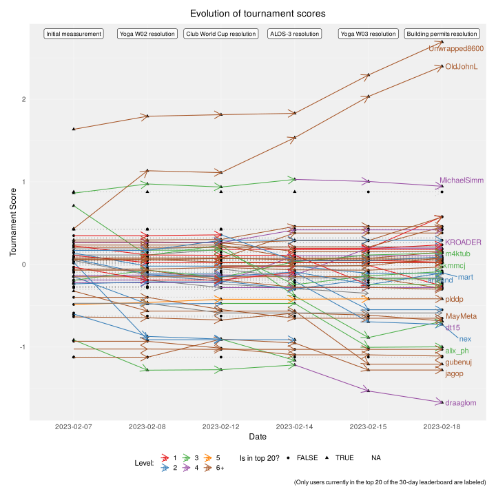
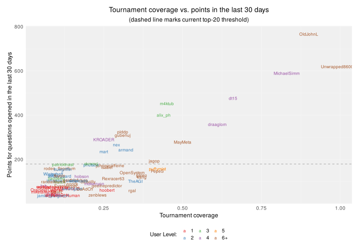

Metaculus Beginners on Points Leaderboard
================
maurogm
2023-02-10

-   [Preparation](#preparation)
    -   [Load libraries](#load-libraries)
    -   [Define paths](#define-paths)
    -   [Define functions](#define-functions)
    -   [Data preparation](#data-preparation)
-   [Exploration](#exploration)
    -   [User evolution](#user-evolution)
    -   [User points](#user-points)
-   [Export table](#export-table)

# Preparation

## Load libraries

``` r
library(data.table)
library(magrittr)
library(dplyr)
library(ggplot2)
library(tidyverse)
library(readxl)
library(ggrepel)
```

## Define paths

``` r
PATH_DATA_DIR <- "data/tournaments/beginner_2023Q1"
PATH_TOURNAMENT_LEADERBOARD <- glue::glue("{PATH_DATA_DIR}/beginner_tournament_leaderboard.xls")
PATH_RANKING_30_DAYS <- glue::glue("{PATH_DATA_DIR}/metaculus_ranking_30_days.xls")
PATH_RANKING_90_DAYS <- glue::glue("{PATH_DATA_DIR}/metaculus_ranking_90_days.xls")

date_labels <- tribble(
    ~date, ~label,
    "2023-02-07", "Initial meassurement",
    "2023-02-08", "Yoga W02 resolution",
)
```

## Define functions

#### Data wrangling functions

``` r
extract_level <- function(vec) stringr::str_extract(vec, "[0-9]+") %>% as.integer()
truncate_level <- function(level, bound = 5) ifelse(as.numeric(level) > bound, "6+", level)
read_ranking <- function(path, sheet_name, leaderboard_type) {
    df <- read_excel(path, sheet = sheet_name)
    add_suffix <- function(colname) paste0(colname, "_", leaderboard_type)
    df %>%
        mutate(level = extract_level(Level)) %>%
        mutate(date = sheet_name) %>%
        select(date, User, level, Rank, Points) %>%
        setnames(c("date", "user", "level", add_suffix("rank"), add_suffix("points")))
}
read_tournament_leaderboard <- function(path, sheet_name, leaderboard_type = "tournament") {
    extract_denominators <- function(v) {
        stringr::str_extract(v, "/[0-9]+") %>%
            stringr::str_replace("/", "")
    }
    extract_numerators <- function(v) {
        stringr::str_extract(v, "[0-9]+/") %>%
            stringr::str_replace("/", "")
    }

    df <- read_excel(path, sheet = sheet_name)
    df %>%
        mutate(
            date = sheet_name,
            answered = as.integer(extract_numerators(Completion)),
            total = as.integer(extract_denominators(Completion)),
            completion = answered / total,
            coverage = as.numeric(stringr::str_remove(Coverage, "%")) / 100
        ) %>%
        select(
            date,
            user = Forecaster,
            rank = Rank,
            take = Take,
            score = Score,
            coverage,
            completion,
            answered,
            total,
        ) %>%
        setnames(old = c("rank"), new = c(paste0("rank_", leaderboard_type)))
}

read_all_sheets <- function(path_to_file, read_function, leaderboard_type) {
    readxl::excel_sheets(path_to_file) %>%
        map(
            ~ read_function(path_to_file, ., leaderboard_type)
        ) %>%
        rbindlist()
}
```

#### Data viz functions

``` r
apply_theme <- function() {
    theme_minimal() +
        theme(
            legend.position = "bottom",
            legend.text = element_text(size = 10),
            legend.key.size = unit(0.5, "cm"),
            plot.title = element_text(size = 14, hjust = 0.5),
            plot.subtitle = element_text(size = 12, hjust = 0.5),
            axis.title = element_text(size = 12),
            axis.text = element_text(size = 10),
            # panel.background = element_rect(fill = "white", color = "black"),
            # panel.border = element_rect(fill = NA, color = "black"),
            # give very light gray background to the plot area, with no box border:
            panel.background = element_rect(fill = "#F0F0F0", color = NA),
            panel.grid.major = element_line(color = "#F5F5F5"),
            panel.grid.minor = element_line(color = "#F7F7F7"),
            plot.margin = unit(c(0.5, 0.5, 0.5, 0.5), "cm")
        )
}

trunc_level_color_scale <- function() {
    scale_color_manual(
        values = c("#e41a1c", "#377eb8", "#4daf4a", "#984ea3", "#ff7f00", "#a65628"),
        breaks = c("1", "2", "3", "4", "5", "6+"),
    )
}
```

Source utils:

``` r
source("R/utils/metaculus.R")
```

## Data preparation

### Read and wrangle data

``` r
tournament_leaderbord <- read_all_sheets(path_to_file = PATH_TOURNAMENT_LEADERBOARD, read_function = read_tournament_leaderboard, leaderboard_type = "tournament")
df_30_days <- read_all_sheets(PATH_RANKING_30_DAYS, read_ranking, "30_days") %>%
    mutate(is_top_20 = rank_30_days <= 20)
df_90_days <- read_all_sheets(PATH_RANKING_90_DAYS, read_ranking, "90_days")

df_joined <- df_30_days %>%
    merge(df_90_days, by = c("date", "user", "level"), all = TRUE) %>%
    merge(tournament_leaderbord, by = c("date", "user"), all = TRUE)

df_current <- df_joined[date == max(date)]

current_point_cutoff_30 <- df_current[
    rank_30_days %in% c(20, 21),
    median(points_30_days)
]
current_point_cutoff_90 <- df_current[
    rank_90_days %in% c(20, 21),
    median(points_90_days)
]
```

# Exploration

## User evolution

``` r
top_score <- max(df_joined$score, na.rm = TRUE)
df_joined %>%
    arrange(date) %>%
    setDT() %>%
    .[, delta := diff(score), user] %>%
    mutate(level = truncate_level(level)) %>%
    ggplot(aes(x = date, y = score)) +
    geom_point(aes(shape = is_top_20)) +
    geom_path(aes(group = user), # arrows where score didn't change
        data = ~filter(., delta == 0),
        alpha = 0.2,
        linetype = "dotted",
        arrow = arrow(length = unit(4, "mm"), ends = "last")
    ) +
    geom_path(aes(group = user, color = level), # arrows where score did change
        data = ~filter(., delta != 0),
        arrow = arrow(length = unit(4, "mm"), ends = "last")
    ) +
    ggrepel::geom_text_repel(aes(label = user, color = level),
        data = filter(df_current, is_top_20) %>%
            mutate(level = truncate_level(level)),
        nudge_x = 0.15
    ) +
    geom_label(
        data = date_labels, aes(x = date, label = label), y = top_score + 0.1,
        size = 3, angle = 25, color = "black", fill = "white", alpha = 0.8
    ) +
    labs(
        title = "Evolution of tournament scores",
        caption = "(Only users currently in the top 20 of the 30-day leaderboard are labeled)",
        x = "Date",
        y = "Tournament Score",
        shape = "Is in top 20?",
        color = "Level: "
    ) +
    trunc_level_color_scale() +
    apply_theme()
```

<!-- -->

## User points

``` r
df_current %>%
    mutate(level = truncate_level(level)) %>%
    ggplot(aes(x = points_30_days, y = points_90_days, color = level)) +
    geom_text(aes(label = user), size = 3, angle = 25) +
    geom_vline(xintercept = current_point_cutoff_30, linetype = "dashed", alpha = 0.3) +
    geom_hline(yintercept = current_point_cutoff_90, linetype = "dashed", alpha = 0.3) +
    trunc_level_color_scale() +
    labs(
        title = "Users in the top 100 of both leaderboards",
        subtitle = "(dashed lines mark current top-20 thresholds)",
        x = "Points for questions opened in the last 30 days",
        y = "Points for questions opened in the last 90 days",
        color = "User Level: "
    ) +
    scale_x_log10() +
    scale_y_log10() +
    apply_theme()
```

<!-- -->

plot-rank-30-vs-rank-tournament:

``` r
df_current %>%
    mutate(level = truncate_level(level)) %>%
    ggplot(aes(x = coverage, y = points_30_days, color = level)) +
    geom_text(aes(label = user), size = 3) +
    geom_hline(yintercept = current_point_cutoff_30, linetype = "dashed", alpha = 0.3) +
    trunc_level_color_scale() +
    labs(
        title = "Tournament coverage vs. points in the last 30 days",
        subtitle = "(dashed line marks current top-20 threshold)",
        x = "Tournament coverage",
        y = "Points for questions opened in the last 30 days",
        color = "User Level: "
    ) +
    apply_theme()
```

<!-- -->

Correlations:

``` r
df_for_cor <- df_current %>%
    filter(!is.na(rank_30_days), !is.na(rank_tournament))
```

Spearman correlation with tournament rank:

``` r
cor(df_for_cor$rank_30_days, df_for_cor$rank_tournament, method = "spearman")
```

    ## [1] 0.4495732

Spearman correlation with tournament coverage:

``` r
cor(df_for_cor$coverage, df_for_cor$rank_tournament, method = "spearman")
```

    ## [1] -0.8109608

### Delta score vs. delta points

(At least for this selection of users) people tend to accumulate points
just by being active, even if they score negatively:

``` r
df_joined %>%
    arrange(date) %>%
    setDT() %>%
    .[, delta_score := score - lag(score), user] %>%
    .[, delta_points := points_30_days - lag(points_30_days), user] %>%
    filter(delta_score != 0) %>% 
    mutate(level = truncate_level(level)) %>%
    ggplot(aes(delta_score, delta_points, label = user, color = level)) +
    geom_text_repel() +
    trunc_level_color_scale() +
    geom_hline(yintercept = 0, linetype = "dashed", alpha = 0.3) +
    geom_vline(xintercept = 0, linetype = "dashed", alpha = 0.3) +
    labs(
        title = "Change in tournament score vs. change in points",
        subtitle = "(only users who changed their scores are shown)",
        x = "Change in tournament score",
        y = "Change in points",
        color = "User Level: "
    ) +
    apply_theme()
```

<!-- -->

# Export table

``` r
df_joined %>%
    filter(date == max(date)) %>%
    select(user, level, rank_30_days, rank_90_days, points_30_days, points_90_days, rank_tournament, answered) %>%
    arrange(rank_30_days, rank_90_days, rank_tournament) %>%
    filter(!is.na(level)) %>%
    setDT() %>%
    .[level <= 5, user := glue::glue("**{user}**")] %>%
    export_markdown_table("beginers_current_data.txt")
```
